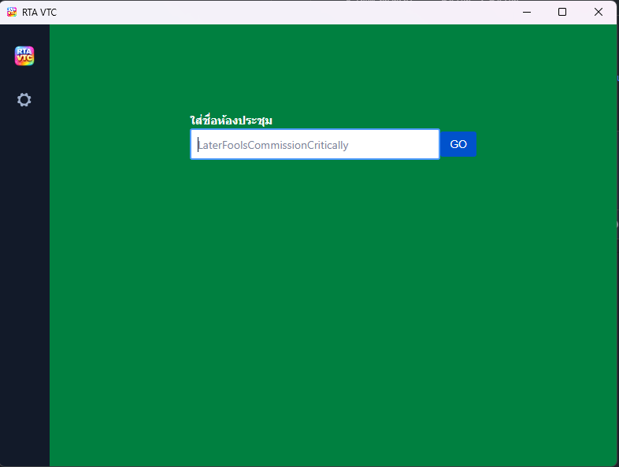

<p align="center">
  
</p>

<h1 align="center">RTA VTC</h1>

<p align="center">
  ระบบประชุมทางไกลผ่านวิดีโอสำหรับกองทัพบก
</p>

<p align="center">
  
</p>

---

## ดาวน์โหลด

| Platform | ไฟล์ติดตั้ง |
|----------|------------|
| **Windows** | [rta-vtc.exe](../../releases/latest/download/rta-vtc.exe) |
| **macOS** | [rta-vtc.dmg](../../releases/latest/download/rta-vtc.dmg) |
| **Linux (AppImage)** | [x86_64](../../releases/latest/download/rta-vtc-x86_64.AppImage) / [arm64](../../releases/latest/download/rta-vtc-arm64.AppImage) |
| **Linux (Deb)** | [x86_64](../../releases/latest/download/rta-vtc-amd64.deb) / [arm64](../../releases/latest/download/rta-vtc-arm64.deb) |

---

## คุณสมบัติ

- การประชุมทางวิดีโอผ่าน server `telemeet.rta.mi.th`
- รองรับ End-to-End Encryption (E2EE)
- แชร์หน้าจอ (Screen Sharing)
- หน้าต่าง Always-on-Top (Picture-in-Picture)
- อัปเดตอัตโนมัติ (Auto-update)
- รองรับ Deeplink: `jitsi-meet://ชื่อห้อง`
- รองรับ Windows, macOS และ Linux

---

## การติดตั้ง

### Windows
1. ดาวน์โหลดไฟล์ `rta-vtc.exe`
2. ดับเบิ้ลคลิกเพื่อติดตั้ง
3. เปิดแอป **RTA VTC** จาก Start Menu

### macOS
1. ดาวน์โหลดไฟล์ `rta-vtc.dmg`
2. เปิดไฟล์ `.dmg` แล้วลาก RTA VTC ไปที่โฟลเดอร์ Applications
3. เปิดแอปจาก Launchpad

### Linux
```bash
# AppImage
chmod +x rta-vtc-x86_64.AppImage
./rta-vtc-x86_64.AppImage

# Deb
sudo dpkg -i rta-vtc-amd64.deb
```

---

## การใช้งาน

1. เปิดแอป **RTA VTC**
2. พิมพ์ชื่อห้องประชุมในช่องกรอก
3. กด **GO** เพื่อเข้าร่วมประชุม
4. อนุญาตการเข้าถึงกล้องและไมโครโฟนเมื่อถูกถาม

---

## สำหรับนักพัฒนา

<details><summary>แสดงขั้นตอนการ build</summary>

### ความต้องการ
- Node.js 22+ (ดู `.nvmrc`)
- Windows: `npm install --global --production windows-build-tools`
- Linux: `sudo apt install libx11-dev zlib1g-dev libpng-dev libxtst-dev`

### ติดตั้ง dependencies
```bash
npm install
```

### รันในโหมด development
```bash
npm start
```

### สร้างไฟล์ติดตั้ง
```bash
npm run dist
```

ไฟล์ติดตั้งจะอยู่ในโฟลเดอร์ `dist/`

</details>

---

## ปัญหาที่ทราบ

### Windows
- จะมีคำเตือนว่าแอปไม่ได้ลงนาม (unsigned) เมื่อติดตั้งครั้งแรก สามารถกด "More info" > "Run anyway" ได้

### Linux
- Ubuntu 22.04+: ต้องติดตั้ง `libfuse2` ก่อน: `sudo apt install libfuse2`
- Ubuntu 24.04+: ถ้าเจอ sandbox error ให้รันด้วย `--no-sandbox`

---

## License

Apache License 2.0 - ดูไฟล์ [LICENSE](LICENSE)
